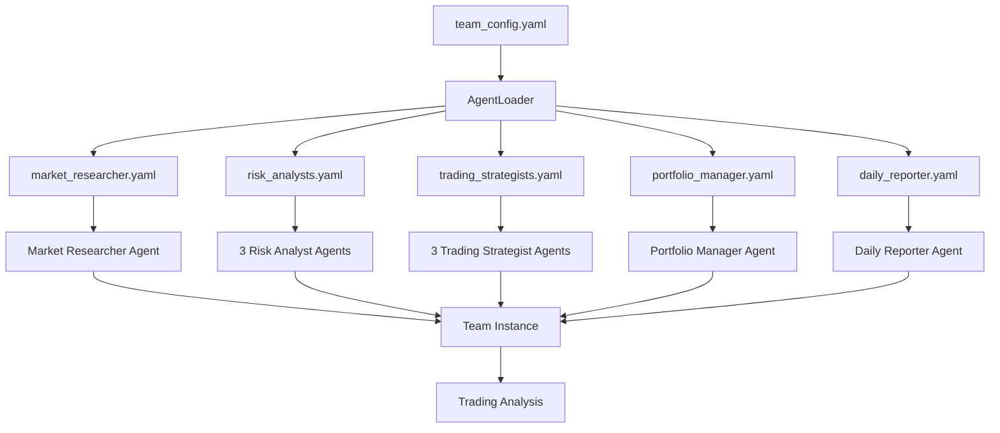

# 🤖 Modular Agent System

## 📁 Arquitectura

```
agents/
├── loader.py                    # Sistema de carga dinámica
├── team_config.yaml            # Configuración del equipo completo
├── market_researcher.yaml      # Configuración Market Researcher
├── risk_analysts.yaml          # Configuración 3 Risk Analysts
├── trading_strategists.yaml    # Configuración 3 Trading Strategists
├── portfolio_manager.yaml      # Configuración Portfolio Manager
├── daily_reporter.yaml         # Configuración Daily Reporter
└── README.md                   # Este archivo
```

---

## 🎯 Ventajas de la Arquitectura Modular

### ✅ **Separación de Concerns**
- **Configuración** (YAML) separada de **lógica** (Python)
- Fácil modificar instrucciones sin tocar código
- Versionado independiente de configs y código

### ✅ **Mantenibilidad**
- Cada agente en su propio archivo
- Cambios localizados (no afectan otros agentes)
- Fácil agregar/quitar agentes

### ✅ **Testabilidad**
- Cargar agentes individuales para testing
- Probar diferentes configuraciones sin reescribir código
- A/B testing de instrucciones

### ✅ **Reutilización**
- Misma configuración en múltiples scripts
- Compartir configuraciones entre proyectos
- Templates para nuevos agentes

### ✅ **Flexibilidad**
- Cambiar modelos (DeepSeek ↔ OpenRouter) vía config
- Habilitar/deshabilitar herramientas fácilmente
- Ajustar temperatura, max_tokens, etc. sin código

---

## 🚀 Uso Rápido

### Cargar Equipo Completo
```python
from agents.loader import load_complete_team

# Cargar equipo de 9 agentes
team = load_complete_team(use_openrouter=True)

# Usar el equipo
team.print_response("Analiza ABEO como micro-cap", stream=True)
```

### Cargar Agentes Individuales
```python
from agents.loader import (
    load_market_researcher,
    load_risk_analysts,
    load_trading_strategists,
    load_portfolio_manager,
    load_daily_reporter
)

# Cargar solo Market Researcher
researcher = load_market_researcher()

# Cargar los 3 Risk Analysts
risk_analysts = load_risk_analysts(portfolio_summary=portfolio.get_summary())

# Cargar los 3 Trading Strategists
strategists = load_trading_strategists()

# Cargar Portfolio Manager
pm = load_portfolio_manager(portfolio_summary=portfolio.get_summary())

# Cargar Daily Reporter
reporter = load_daily_reporter(portfolio_summary=portfolio.get_summary())
```

### Cargar con AgentLoader (control total)
```python
from agents.loader import AgentLoader

loader = AgentLoader()

# Cargar agente específico
researcher = loader.load_agent("market_researcher")

# Cargar agente anidado
risk_conservative = loader.load_agent(
    agent_id="risk_conservative",
    config_file="risk_analysts.yaml",
    config_key="agents.conservative"
)

# Cargar equipo completo
team = loader.load_team(use_openrouter=True)
```

---

## 📝 Estructura de Configuración YAML

### Ejemplo: market_researcher.yaml
```yaml
name: "Market Researcher"
role: "Deep market analysis specialist"
agent_type: "research"

model:
  provider: "deepseek"
  model_id: "deepseek-chat"
  temperature: 0.7
  max_tokens: 4000

tools:
  yfinance:
    enabled: true
    include_all: true
  serper:
    enabled: true
    required: false

instructions:
  language: "es"
  critical_rules:
    - "⚠️ CRÍTICO: Responde SIEMPRE en ESPAÑOL"
  expertise:
    - "Especialista en micro-cap"
  tool_usage:
    yfinance:
      - "Precio actual, fundamentales"
    serper:
      - "Noticias recientes"
  
output:
  markdown: true
  format: "detailed_report"

metadata:
  version: "2.0"
  priority: 1
  estimated_time: "2-3 minutes"
  cost_per_run: "$0.0002"
```

### Ejemplo: risk_analysts.yaml (Multi-Agent)
```yaml
agents:
  conservative:
    name: "Risk Analyst Conservador"
    weight: 0.40
    model:
      provider: "deepseek"
    instructions:
      profile:
        philosophy: "Evitar pérdidas > Maximizar ganancias"
      criteria:
        debt_to_equity: "< 30%"
        beta: "< 1.2"
  
  moderate:
    name: "Risk Analyst Moderado"
    weight: 0.30
    # ... config ...
  
  aggressive:
    name: "Risk Analyst Agresivo"
    weight: 0.30
    # ... config ...

consensus:
  method: "weighted_average"
  weights:
    conservative: 0.40
    moderate: 0.30
    aggressive: 0.30
```

---

## 🔧 Modificar Configuraciones

### Cambiar Modelo de un Agente
```yaml
# En portfolio_manager.yaml
model:
  provider: "openrouter"
  model_id: "qwen/qwen3-235b-a22b:free"  # ← Cambiar aquí
  fallback:
    provider: "deepseek"
    model_id: "deepseek-chat"
```

### Agregar Nueva Instrucción
```yaml
# En market_researcher.yaml
instructions:
  critical_rules:
    - "⚠️ CRÍTICO: Responde SIEMPRE en ESPAÑOL"
    - "⚠️ NUEVO: Enfócate en micro-cap < $100M"  # ← Agregar aquí
```

### Deshabilitar Herramienta
```yaml
# En market_researcher.yaml
tools:
  yfinance:
    enabled: true
  serper:
    enabled: false  # ← Deshabilitar Serper
```

### Cambiar Pesos de Consenso
```yaml
# En risk_analysts.yaml
consensus:
  weights:
    conservative: 0.50  # ← Aumentar peso conservador
    moderate: 0.30
    aggressive: 0.20    # ← Reducir peso agresivo
```

---

## 🧪 Testing

### Test de Carga de Configuraciones
```python
from agents.loader import AgentLoader

loader = AgentLoader()

# Test: Cargar YAML sin errores
config = loader.load_yaml("market_researcher.yaml")
assert config['name'] == "Market Researcher"

# Test: Cargar agente
agent = loader.load_agent("market_researcher")
assert agent.name == "Market Researcher"

# Test: Cargar equipo completo
team = loader.load_team()
assert len(team.members) == 9
```

### Test de Agent Individual
```python
from agents.loader import load_market_researcher

# Cargar agente
researcher = load_market_researcher()

# Test simple
response = researcher.run("¿Cuál es el precio de AAPL?")
print(response.content)
```

---

## 📊 Workflow del Sistema



---

## 🎯 Casos de Uso

### 1. **Experimentar con Diferentes Modelos**
```yaml
# Test 1: DeepSeek para todos
model:
  provider: "deepseek"
  model_id: "deepseek-chat"

# Test 2: OpenRouter modelos premium
model:
  provider: "openrouter"
  model_id: "anthropic/claude-3-opus"

# Test 3: Mix (DeepSeek + OpenRouter free)
# Market Researcher: DeepSeek (confiable + tools)
# Portfolio Manager: OpenRouter (razonamiento avanzado)
```

### 2. **A/B Testing de Instrucciones**
```yaml
# Versión A: Conservadora
instructions:
  philosophy:
    - "Conservador por defecto"
    - "Riesgo solo con consenso sólido"

# Versión B: Agresiva
instructions:
  philosophy:
    - "Busca oportunidades de alto crecimiento"
    - "Tolera volatilidad por retorno"
```

### 3. **Agregar Nuevo Agente**
```yaml
# nuevo_agente.yaml
name: "Sentiment Analyst"
role: "Social media and news sentiment analysis"
agent_type: "sentiment"

model:
  provider: "deepseek"
  model_id: "deepseek-chat"

tools:
  serper:
    enabled: true

instructions:
  critical_rules:
    - "⚠️ CRÍTICO: Responde en ESPAÑOL"
  expertise:
    - "Analiza sentiment en redes sociales"
    - "Identifica tendencias virales"
```

Luego agregar a `team_config.yaml`:
```yaml
members:
  - id: "sentiment_analyst"
    config_file: "nuevo_agente.yaml"
    required: false  # Opcional
```

---

## 🔄 Migración desde Sistema Anterior

### Antes (hardcoded)
```python
def create_market_researcher():
    return Agent(
        name="Market Researcher",
        role="Deep market analysis",
        model=DeepSeek(id="deepseek-chat"),
        tools=[YFinanceTools(), SerperTools()],
        instructions=[
            "Eres un especialista...",
            "Proporciona análisis...",
            # ... 20 líneas más ...
        ]
    )
```

### Después (modular)
```python
from agents.loader import load_market_researcher

# Una línea!
researcher = load_market_researcher()
```

**Ventajas:**
- ✅ Instrucciones en YAML (fácil de editar)
- ✅ Versionable separadamente
- ✅ Reutilizable en múltiples scripts
- ✅ Testing más simple

---

## 📈 Roadmap

### ✅ Completado
- [x] Sistema de carga YAML
- [x] Configuraciones de 9 agentes
- [x] AgentLoader con soporte anidado
- [x] Funciones de conveniencia (quick loaders)
- [x] Documentación completa

### 🔄 En Progreso
- [ ] Validación de esquemas YAML
- [ ] Sistema de templates
- [ ] CLI para gestionar configuraciones
- [ ] Hot-reload de configuraciones

### 🎯 Futuro
- [ ] UI web para editar configuraciones
- [ ] Sistema de plugins para agentes
- [ ] Marketplace de configuraciones
- [ ] Auto-tuning de parámetros

---

## 🛠️ Comandos Útiles

### Validar Configuración
```bash
python -c "from agents.loader import AgentLoader; AgentLoader().load_yaml('market_researcher.yaml')"
```

### Listar Todos los Agentes
```bash
ls agents/*.yaml
```

### Backup de Configuraciones
```bash
tar -czf agent_configs_backup_$(date +%Y%m%d).tar.gz agents/*.yaml
```

---

## 💡 Tips & Best Practices

### ✅ DO
- ✅ Usar comentarios en YAML para documentar cambios
- ✅ Versionar configuraciones con git
- ✅ Mantener backups antes de cambios grandes
- ✅ Probar configuraciones antes de producción
- ✅ Usar nombres descriptivos para agentes

### ❌ DON'T
- ❌ Hardcodear API keys en YAML (usar env vars)
- ❌ Duplicar configuraciones (usar referencias YAML)
- ❌ Mezclar lógica y configuración
- ❌ Olvidar actualizar metadata (version, cost, time)

---

## 🤝 Contribuir

Para agregar un nuevo agente:

1. Crear `nuevo_agente.yaml` basándote en templates existentes
2. Probar con `AgentLoader().load_agent("nuevo_agente")`
3. Agregar a `team_config.yaml` si es parte del equipo
4. Actualizar este README
5. Crear PR con descripción del agente

---

**Versión:** 2.0  
**Última Actualización:** Octubre 2025  
**Autor:** Trading Team Architecture  
**Licencia:** MIT
