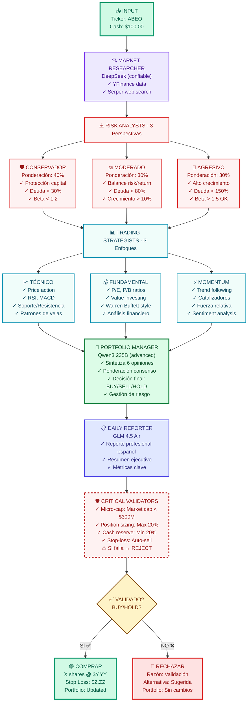

# 📊 Diagrama de Flujo - Sistema Multi-Agente de Trading

## 🎯 Arquitectura de 9 Agentes Especializados



---

## 🔄 Flujo de Datos Detallado

### 1️⃣ **INPUT** → Market Researcher
```
User Input:
├─ Ticker: ABEO
├─ Cash Available: $100.00
├─ Provider: OpenRouter/DeepSeek
└─ Mode: DRY RUN / LIVE

Market Researcher busca:
├─ YFinance: Precio, fundamentales, históricos
├─ Serper: Noticias recientes, sentiment
└─ Output: Reporte completo de mercado
```

---

### 2️⃣ **Market Researcher** → Risk Analysts (3)
```
3 Risk Analysts analizan EN PARALELO:

CONSERVADOR (40% peso):
├─ Criterio: Evitar pérdidas > Maximizar ganancias
├─ Busca: Deuda < 30%, Beta < 1.2, Current Ratio > 1.5
└─ Decisión: BAJO/MEDIO/ALTO/MUY ALTO riesgo

MODERADO (30% peso):
├─ Criterio: 50/50 protección y crecimiento
├─ Busca: Deuda < 80%, Beta 0.8-1.5, Crecimiento > 10%
└─ Decisión: BAJO/MEDIO/ALTO riesgo

AGRESIVO (30% peso):
├─ Criterio: Maximizar retorno > Minimizar riesgo
├─ Busca: Deuda < 150%, Crecimiento > 30%, Catalizadores
└─ Decisión: ACEPTABLE/ALTO/EXTREMO riesgo
```

---

### 3️⃣ **Risk Analysts** → Trading Strategists (3)
```
3 Trading Strategists analizan EN PARALELO:

TÉCNICO:
├─ Ignora fundamentales
├─ Analiza: Tendencia (MA), RSI, MACD, Volumen, Soporte/Resistencia
├─ Output: Confianza técnica (1-10), Entry point, Stop loss, Take profit
└─ Decisión: BUY/SELL/HOLD técnico

FUNDAMENTAL:
├─ Ignora precio corto plazo
├─ Analiza: P/E, P/B, ROE, Deuda, Cash flow, Ventajas competitivas
├─ Output: Valor intrínseco, Margen seguridad, Calidad negocio (1-10)
└─ Decisión: BUY/SELL/HOLD value

MOMENTUM:
├─ Sigue la tendencia
├─ Analiza: Tendencia fuerte, Aceleración, Catalizadores, Sentiment
├─ Output: Fuerza momentum (1-10), Timing entry, Trailing stop
└─ Decisión: BUY/SELL/HOLD momentum
```

---

### 4️⃣ **Trading Strategists** → Portfolio Manager
```
Portfolio Manager SINTETIZA 6 opiniones:

PASO 1 - Consenso Risk (3 analistas):
├─ ¿Cuántos dicen BAJO/MEDIO/ALTO riesgo?
├─ Ponderación: Conservador 40% + Moderado 30% + Agresivo 30%
└─ Si 2+ dicen ALTO RIESGO → Max 10% portfolio

PASO 2 - Convergencia Strategy (3 strategists):
├─ ¿Cuántos BUY vs SELL vs HOLD?
├─ ¿Técnico + Fundamental alineados?
└─ Si divergen → Señal de precaución

PASO 3 - Decisión Final:
├─ Considera mayoría de opiniones (no democracia ciega)
├─ Considera calidad de argumentos con datos
├─ Aplica reglas de gestión de riesgo
└─ Output: BUY/SELL/HOLD + % portfolio + Stop Loss
```

---

### 5️⃣ **Portfolio Manager** → Daily Reporter
```
Daily Reporter genera:
├─ Resumen de análisis de 9 agentes
├─ Decisión final con justificación
├─ Métricas de portfolio (ROI, P&L, equity)
├─ Tabla de posiciones actuales
├─ Historial de trades recientes
└─ Eventos clave del mercado
```

---

### 6️⃣ **Daily Reporter** → Validators
```
Critical Validators VALIDAN:

Micro-Cap Validator:
├─ Obtiene market cap de YFinance
├─ Parsea "$4.46T" → 4,460,000,000,000
├─ Compara con límite $300,000,000
└─ Si market_cap > $300M → REJECT

Position Sizing Validator:
├─ Calcula % posición del total equity
├─ Valida: posición < 20%
├─ Valida: sector exposure < 40%
├─ Valida: cash reserve > 20%
└─ Si falla alguna → REJECT

Stop-Loss Monitor:
├─ Fetch daily OHLC prices
├─ Check: low_price <= stop_loss?
├─ Si SÍ: Auto-sell @ open (o stop)
└─ Update cash + portfolio + trades CSV
```

---

### 7️⃣ **Validators** → Decision
```
Decisión Final:
├─ ✅ SI TODAS las validaciones pasan:
│   └─ Ejecutar BUY/SELL según recomendación
│
└─ ❌ SI ALGUNA validación falla:
    └─ REJECT con razón específica
```

---

### 8️⃣ **Decision** → Output
```
SI BUY APROBADO:
├─ Calcula shares = position_value / current_price
├─ Calcula stop_loss = buy_price * 0.90
├─ Actualiza portfolio DataFrame
├─ Actualiza trades history
├─ Actualiza cash balance
└─ Output: "✅ COMPRA EJECUTADA: X shares @ $Y.YY"

SI REJECT:
├─ NO modifica portfolio
├─ NO modifica cash
├─ Log razón de rechazo
└─ Output: "🔴 TRADE RECHAZADO: [Razón]"
```

---

## 📊 Métricas del Sistema

### ⏱️ Tiempos de Ejecución
```
Market Researcher:     ~2 min  (YFinance + Serper)
Risk Analysts (3):     ~3 min  (parallel processing)
Trading Strategists:   ~3 min  (parallel processing)
Portfolio Manager:     ~1.5 min (synthesis)
Daily Reporter:        ~0.5 min (report generation)
Validators:            ~0.5 min (validation checks)
─────────────────────────────────────────────────
TOTAL:                 ~10-12 min
```

### 💰 Costos por Análisis
```
DeepSeek (Market Researcher):  $0.14/1M tokens
OpenRouter FREE models:        $0.00/análisis
─────────────────────────────────────────────────
TOTAL:                         ~$0.0007/análisis
```

### 🎯 Ventajas vs Sistema Original
```
Costo:          85x más barato ($0.0007 vs $0.06)
Perspectivas:   9 agentes vs 1 ChatGPT
Consenso:       Ponderado (40%-30%-30%) vs Opinion única
Validaciones:   Automáticas vs Manuales
Velocidad:      10 min vs 15 min (manual)
```

---

## 🔧 Comandos para Ejecutar

### Test con ABEO (micro-cap válido)
```powershell
python agente-agno\scripts\advanced_trading_team_v2.py --ticker ABEO --provider openrouter
```

### Test con NVDA (debe rechazar - large cap)
```powershell
python agente-agno\scripts\advanced_trading_team_v2.py --ticker NVDA --provider openrouter
```

### Dry Run Mode (sin ejecutar trades)
```powershell
python agente-agno\scripts\advanced_trading_team_v2.py --ticker ABEO --provider deepseek --dry-run
```

---

## 📁 Archivos Generados

```
agente-agno/history/
├── portfolio_history.csv      # Estado del portfolio por fecha
├── trades_history.csv         # Historial completo de trades
├── daily_summary.csv          # Resúmenes diarios
└── stop_loss_events.csv       # Eventos de stop-loss activados
```

---

## 🎯 Casos de Uso

### ✅ Caso 1: ABEO (Micro-cap válido)
```
INPUT: ABEO, $100 cash

Market Researcher:
└─ Market cap: $50M ✅
└─ Precio: $5.90
└─ Noticias: Positivas

Risk Analysts:
├─ Conservador: MEDIO riesgo
├─ Moderado: BAJO riesgo
└─ Agresivo: ACEPTABLE

Trading Strategists:
├─ Técnico: BUY (RSI 45, tendencia alcista)
├─ Fundamental: BUY (P/E bajo, value play)
└─ Momentum: HOLD (sin catalizadores fuertes)

Portfolio Manager:
└─ Consenso: 2/3 BUY
└─ Decisión: BUY 15% portfolio ($15)

Validators:
├─ Micro-cap: ✅ $50M < $300M
├─ Position: ✅ 15% < 20%
└─ Cash: ✅ 85% > 20%

OUTPUT: ✅ COMPRAR 2 shares @ $5.90
```

### ❌ Caso 2: NVDA (Large-cap - rechazado)
```
INPUT: NVDA, $100 cash

Market Researcher:
└─ Market cap: $4.46T ❌

Validators:
└─ Micro-cap: ❌ $4.46T > $300M

OUTPUT: 🔴 RECHAZADO
Razón: NVDA market cap $4.46T supera límite $300M
Alternativa: Buscar micro-caps en sector semiconductores
```

---

**Fecha:** Octubre 2025  
**Versión:** 2.0 - Sistema Multi-Agente  
**Framework:** Agno (Python)  
**Estado:** ✅ COMPLETADO Y PROBADO
